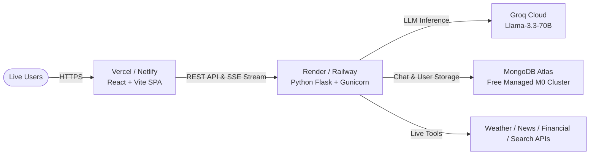

# Live Production Deployment Guide: Multi-AI Agents System

This comprehensive guide walks you through deploying the complete **Multi-AI Agents System** live to the web.

---

## 🌟 Recommended Free Cloud Architecture



---

## 📋 Pre-Deployment Checklist: Required API Keys

Before starting, ensure you have:
1. **Groq API Key**: (Free tier) [console.groq.com](https://console.groq.com/)
2. **MongoDB Atlas URI**: (Free M0 cluster) [mongodb.com/cloud/atlas](https://www.mongodb.com/cloud/atlas)
3. *(Optional Live APIs)*:
   - OpenWeather API Key: [openweathermap.org](https://openweathermap.org/)
   - NewsAPI Key: [newsapi.org](https://newsapi.org/)
   - Alpha Vantage API Key: [alphavantage.co](https://www.alphavantage.co/)
   - Google Custom Search API Key & Engine ID: [console.cloud.google.com](https://console.cloud.google.com/)

---

## 🚀 Step 1: Set Up Free Cloud MongoDB Atlas (3 Minutes)

1. Sign up / Log in to [MongoDB Atlas](https://www.mongodb.com/cloud/atlas).
2. Click **Create a Deployment** and select the **M0 Free** cluster (AWS, Google Cloud, or Azure in your closest region).
3. **Database Access**:
   - Create a database user with username (e.g. `admin`) and a secure password.
4. **Network Access**:
   - Click **Network Access** > **Add IP Address**.
   - Select **Allow Access from Anywhere** (`0.0.0.0/0`) so cloud servers (Render/Vercel/Railway) can connect.
5. **Get Connection String**:
   - Go to **Database** > **Connect** > **Drivers** (Python).
   - Copy the URI string:
     ```text
     mongodb+srv://<username>:<password>@cluster0.xxxxx.mongodb.net/multi_ai_agents?retryWrites=true&w=majority
     ```
   - Replace `<username>` and `<password>` with your database user credentials.

---

## 🚀 Step 2: Deploy Backend to Render (Free Web Service)

1. Sign in to [Render](https://render.com/) with your GitHub account.
2. Click **New +** > **Web Service**.
3. Connect your repository: `menariyavishal/Multi-Ai-Agents`.
4. Fill in the settings:
   - **Name**: `multi-ai-agents-backend`
   - **Language**: `Python`
   - **Region**: Any (e.g., `Oregon (US West)` or `Frankfurt`)
   - **Branch**: `main`
   - **Root Directory**: `backend`
   - **Build Command**: `pip install -r requirements.txt`
   - **Start Command**: `gunicorn --config gunicorn.conf.py wsgi:app`
   - **Instance Type**: `Free`
5. Click **Advanced** > **Add Environment Variable**:

   | Key | Value | Notes |
   |---|---|---|
   | `FLASK_ENV` | `production` | Enables production mode |
   | `SECRET_KEY` | *(Click "Generate" or type a random 32-char string)* | JWT / Session encryption |
   | `GROQ_API_KEY` | `gsk_your_groq_key` | Required for agent reasoning |
   | `MONGODB_URI` | `mongodb+srv://...` | Your MongoDB Atlas connection string |
   | `MONGODB_DB_NAME` | `multi_ai_agents` | Database name |
   | `OPENWEATHER_API_KEY` | *(optional)* | OpenWeather API key |
   | `NEWS_API_KEY` | *(optional)* | NewsAPI key |
   | `ALPHA_VANTAGE_API_KEY` | *(optional)* | Alpha Vantage key |
   | `GOOGLE_SEARCH_API_KEY` | *(optional)* | Google Search key |
   | `GOOGLE_SEARCH_ENGINE_ID` | *(optional)* | Google Search Engine ID |

6. Click **Create Web Service**.
7. Once deployed, copy your live backend URL (e.g., `https://multi-ai-agents-backend.onrender.com`).
8. Test backend health: Open `https://multi-ai-agents-backend.onrender.com/health` in your browser. You should see:
   ```json
   {
     "database_connected": true,
     "environment": "production",
     "status": "healthy",
     "version": "1.0.0"
   }
   ```

---

## 🚀 Step 3: Deploy Frontend to Vercel (Fast Global CDN)

1. Sign in to [Vercel](https://vercel.com/) with GitHub.
2. Click **Add New...** > **Project**.
3. Select `Multi-Ai-Agents`.
4. In the configuration page:
   - **Root Directory**: Click *Edit* and select `frontend`.
   - **Framework Preset**: `Vite` (automatically detected).
   - **Build Command**: `npm run build`
   - **Output Directory**: `dist`
5. Expand **Environment Variables** and add:

   | Key | Value |
   |---|---|
   | `VITE_API_BASE_URL` | `https://multi-ai-agents-backend.onrender.com/api/v1` *(replace with your Render backend URL)* |

6. Click **Deploy**.
7. Your app is now **LIVE** globally with an HTTPS URL (e.g., `https://multi-ai-agents.vercel.app`)!

---

## 🐳 Alternative: 1-Command Self-Hosting with Docker Compose (VPS / AWS / DigitalOcean)

If you prefer hosting on your own Linux VPS, AWS EC2, or DigitalOcean Droplet:

1. **SSH into your server** and ensure Docker and Docker Compose are installed:
   ```bash
   sudo apt-get update && sudo apt-get install -y docker.io docker-compose-v2
   ```

2. **Clone the repository**:
   ```bash
   git clone https://github.com/menariyavishal/Multi-Ai-Agents.git
   cd Multi-Ai-Agents
   ```

3. **Create `.env` file**:
   ```bash
   cp backend/.env.production.example .env
   nano .env # Paste your GROQ_API_KEY and other keys
   ```

4. **Launch all containers**:
   ```bash
   docker compose up -d --build
   ```

5. **Verify running containers**:
   ```bash
   docker compose ps
   ```
   Access your application at `http://<your-server-ip>` (Port 80 serves frontend + proxies backend APIs).

---

## 🧪 Post-Deployment Live Verification

After deployment, test the full agent pipeline on your live site:

1. **Register a User**:
   - Open your live frontend URL (`https://your-frontend.vercel.app/register`).
   - Create a test account (e.g. `testuser@example.com`).
   - Verify that your API key is automatically created and stored.

2. **Run a Multi-Agent Query**:
   - On the Home page, ask a complex research question:
     > *"What are the latest AI hardware advancements in 2026 and how do they impact data center energy consumption?"*
   - Watch the live **LangGraph visualizer**:
     - **Planner** decomposes the goal.
     - **Researcher** fetches real-time & historical context.
     - **Analyst** categorizes insights and metrics.
     - **Writer** drafts a structured response.
     - **Reviewer** validates facts and consistency.
   - Verify real-time Server-Sent Events (SSE) streaming updates in the terminal console.

3. **Check History**:
   - Click the **History** tab in the navbar.
   - Confirm that the query, agent results, execution time, and iterations are persisted from MongoDB.

---

## 🛠️ Common Troubleshooting

| Issue | Cause | Solution |
|---|---|---|
| **CORS Error in Browser Console** | Backend missing CORS origin | Fixed automatically by `flask-cors` in `app/__init__.py`. Ensure backend URL in `VITE_API_BASE_URL` includes `https://`. |
| **Page Refresh returns 404 on Vercel** | SPA routing not rewriten | Fixed automatically by `vercel.json` and `public/_redirects`. |
| **SSE Stream Not Updating Live** | Nginx or Cloud proxy buffering stream responses | `docker/nginx.conf` has `proxy_buffering off` enabled; `gunicorn.conf.py` uses threaded workers. |
| **Render Web Service Sleep on Free Tier** | Free Render instances sleep after 15m inactivity | First request takes ~30s to wake up. Use a free UptimeRobot monitor pinging `/health` every 5m to keep it warm. |
| **MongoDB Connection Failure** | IP whitelist in Atlas blocking requests | In MongoDB Atlas -> Network Access -> Add IP `0.0.0.0/0`. |
